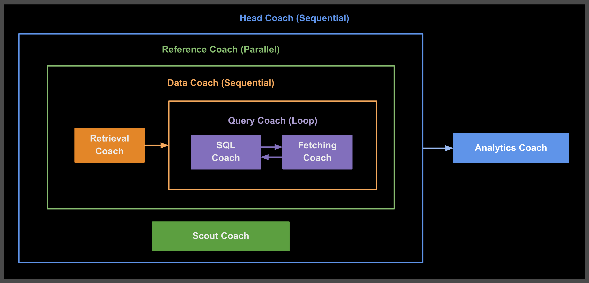

# 2-ohtani-rag 使用說明書

本目錄包含一個複雜的 Multi-Agent 及 RAG 系統，專門用於大谷翔平相關的數據查詢、情報蒐集，並且協同合作來提供全面的運動員分析報告。

## 系統架構圖



## 目錄結構

```
2-ohtani-rag/
├── .env.example                     # 環境變數配置範例
├── README.md                        # 本說明文件
└── head_coach_agent/                # 主控制代理
    ├── __init__.py
    ├── agent.py                     # 主代理定義
    └── subagents/                   # 子代理目錄
        ├── __init__.py
        ├── analytics_coach_agent/   # 分析教練代理
        │   ├── __init__.py
        │   └── agent.py
        ├── fetching_coach_agent/    # 數據提取代理
        │   ├── __init__.py
        │   ├── agent.py
        │   └── tools.py
        ├── retrieval_coach_agent/   # 檢索代理
        │   ├── __init__.py
        │   ├── agent.py
        │   └── tools.py
        ├── scout_coach_agent/       # 情蒐代理
        │   ├── __init__.py
        │   └── agent.py
        └── sql_coach_agent/         # SQL 生成代理
            ├── __init__.py
            └── agent.py
```

## 環境設定

### 1. 配置環境變數

首先，複製 `.env.example` 檔案並重新命名為 `.env`：

```bash
cp .env.example .env
```

然後根據您的需求選擇以下其中一種配置方式：

#### 選項 1: 使用 Vertex AI
```env
GOOGLE_GENAI_USE_VERTEXAI=TRUE
GOOGLE_CLOUD_PROJECT=your-project-id
GOOGLE_CLOUD_LOCATION=us-east5
```

#### 選項 2: 使用 Google AI API
```env
GOOGLE_GENAI_USE_VERTEXAI=FALSE
GOOGLE_API_KEY=your-api-key
```

⚠️ **重要提醒**：請勿將真實的 API 金鑰提交到版本控制系統中。

### 2. 安裝依賴套件

確保您已安裝必要的 Python 套件

## 啟動和使用方式

### 1. 身份驗證設定（僅限 Vertex AI 使用者）

如果您在環境設定中選擇了「Vertex AI」，必須先進行 Google Cloud 身份驗證：

```bash
gcloud auth application-default login
```

**注意**：如果您使用的是「Google AI Studio」，請跳過此步驟。

### 2. 初始化向量資料庫

⚠️ **重要步驟**：在首次使用系統前，您必須先執行以下腳本來初始化向量資料庫：

```bash
cd 2-ohtani-rag/head_coach_agent/subagents/retrieval_coach_agent/prep_embedding
python embed_to_chromadb.py
```

此腳本會：
- 創建兩個 ChromaDB 向量資料庫（`vdb_schema` 和 `vdb_examples`）
- 使用 Gemini 嵌入模型生成向量
- 將資料庫 schema 文件嵌入到 `vdb_schema`
- 將查詢範例文件嵌入到 `vdb_examples`

**注意**：此步驟只需要執行一次。如果您看到「已添加文件到 vdb_schema」和「已添加文件到 vdb_examples」的訊息，表示初始化成功。

### 3. 啟動 Dev UI

使用終端機導航到 2-ohtani-rag 目錄：

```bash
cd 2-ohtani-rag
```

執行以下命令啟動 Dev UI：

```bash
adk web
```

### 4. 開啟網頁介面

在瀏覽器中開啟提供的 URL（通常是 `http://localhost:8000`），在左上角的下拉選單中選擇 `head_coach_agent`。

## 系統功能介紹

### 主控制代理

**Head Coach Agent** 是整個系統的核心控制器，採用 `SequentialAgent` 架構，負責協調所有子代理的工作流程。

### 子代理詳細說明

#### 1. Reference Coach (Parallel Agent)

**功能**：並行執行數據查詢和情報蒐集
- 同時啟動 Data Coach 和 Scout Coach
- 提高系統效率，減少總體執行時間

#### 2. Data Coach (Sequential Agent)

**功能**：順序執行數據檢索和查詢流程
- 先執行 Retrieval Coach 獲取資料庫結構
- 再執行 Query Coach 進行數據查詢

#### 3. Query Coach (Loop Agent)

**功能**：循環執行 SQL 生成和數據提取
- 最多執行 3 次迭代
- 包含 SQL Coach 和 Fetching Coach
- 直到獲得滿意的查詢結果或達到最大迭代次數

#### 4. Retrieval Coach Agent

**檔案位置**：`head_coach_agent/subagents/retrieval_coach_agent/agent.py`

**功能描述**：
- 專門負責檢索和提供資料庫 schema 及 SQL 查詢範例
- 根據使用者問題判斷是否與大谷翔平相關
- 初始化系統狀態並提供資料庫結構資訊

**主要特色**：
- 具備 `retrieve_schema_and_example` 工具
- 嚴格的相關性判斷機制

**工作流程**：
1. 判斷問題是否與大谷翔平相關
2. 檢索相關的資料庫 schema 和查詢範例
3. 按照固定格式輸出結果

#### 5. SQL Coach Agent

**檔案位置**：`head_coach_agent/subagents/sql_coach_agent/agent.py`

**功能描述**：
- 專門負責分析使用者問題並生成對應 SQL 查詢
- 根據檢索到的資料庫 schema 和範例構建精確的 SQL 語句
- 具備錯誤回饋機制

**主要特色**：
- 純 SQL 輸出，無額外說明文字
- 支援錯誤回饋和迭代改進

**輸出格式**：
- 只輸出可直接執行的 SQL 語句
- 不包含任何註解或說明
- 不使用程式碼區塊標記

#### 6. Fetching Coach Agent

**檔案位置**：`head_coach_agent/subagents/fetching_coach_agent/agent.py`

**功能描述**：
- 能夠執行 SQL 語句查詢 SQLite 數據庫
- 根據查詢結果判斷是否符合用戶需求
- 控制循環代理的退出條件

**主要特色**：
- 具備 `execute_sql` 和 `exit_loop` 工具
- 智能判斷查詢結果是否滿足需求

**工作邏輯**：
1. 執行 SQL 查詢
2. 評估查詢結果是否符合需求
3. 決定是否退出循環或繼續迭代

#### 7. Scout Coach Agent

**檔案位置**：`head_coach_agent/subagents/scout_coach_agent/agent.py`

**功能描述**：
- 情蒐教練代理，專門進行運動員相關的情報蒐集與總結
- 使用 Google 搜尋工具獲取最新資訊
- 智能判斷是否需要網路查詢

**主要特色**：
- 具備 `google_search` 工具
- 專注於運動員相關情報

**查詢原則**：
- 可查詢任何運動員的相關資訊
- 預設查詢大谷翔平相關資訊
- 只在需要網路資料時才使用搜尋工具

#### 8. Analytics Coach Agent

**檔案位置**：`head_coach_agent/subagents/analytics_coach_agent/agent.py`

**功能描述**：
- 分析教練代理，專門整合情蒐資料與數據庫查詢結果
- 提供綜合性的運動員分析報告
- 結合定量數據與定性情報

**主要特色**：
- 整合多方面資料來源
- 專業的運動分析角度

**分析原則**：
1. **數據優先**：以數據庫的實際數據為分析基礎
2. **情報補強**：用網路情蒐的資訊補充和驗證數據分析
3. **全面整合**：將定量數據與定性情報相結合
4. **專業呈現**：用專業的運動分析角度來解讀和呈現結果

## 使用範例

**問題**：「大谷翔平最近的打擊表現如何？」

**系統執行流程**：
1. **Reference Coach** 並行啟動數據查詢和情報蒐集
2. **Retrieval Coach** 檢索相關的資料庫 schema 和查詢範例
3. **SQL Coach** 生成查詢大谷翔平最近打擊數據的 SQL 語句
4. **Fetching Coach** 執行 SQL 查詢並獲取數據
5. **Scout Coach** 同時搜尋網路上關於大谷翔平最新表現的資訊
6. **Analytics Coach** 整合數據庫數據和網路情報，提供綜合分析報告

## 系統特色

### 1. 智能相關性判斷
- 所有代理都具備智能判斷機制
- 能識別與大谷翔平或運動員相關的問題
- 對不相關問題會適當拒絕或引導

### 2. 多層次架構設計
- **Sequential**：確保工作流程的順序性
- **Parallel**：提高系統執行效率
- **Loop**：支援迭代改進和錯誤修正

### 3. 錯誤處理和回饋機制
- SQL 查詢失敗時會進行迭代改進
- 具備 review_feedback 機制記錄和學習錯誤
- 智能判斷查詢結果是否滿足需求

### 4. 多模態資料整合
- 結合結構化數據庫資料
- 整合非結構化網路情報
- 提供全面的分析視角

## 技術架構說明

### 代理類型

1. **SequentialAgent**：按順序執行子代理
2. **ParallelAgent**：並行執行子代理
3. **LoopAgent**：循環執行子代理，支援迭代改進
4. **LlmAgent**：基於大語言模型的單一代理

### 狀態管理機制

ADK 提供了強大的狀態管理機制，讓代理之間能夠有效地共享資訊和狀態：

#### **狀態設置與讀取**
- **工具中的狀態操作**：在工具函數中，可以透過 `tool_context.state` 來設置或讀取狀態
- **代理輸出狀態**：代理的 `output_key` 也是狀態設置的一種方式
- **跨代理共享**：透過狀態機制，不同代理可以共享資訊和執行狀態

#### **狀態傳遞流程**
1. **狀態設定或更新**：各代理在執行過程中建立或更新相關狀態資訊
2. **狀態讀取**：後續代理可以讀取前面設置的狀態，實現資訊傳遞
3. **錯誤回饋**：例如 SQL 查詢失敗時，錯誤資訊會記錄到狀態中供後續迭代使用

#### **實際應用範例**
- **review_feedback 狀態**：記錄 SQL 查詢的錯誤資訊，供 SQL Coach 改進查詢
- **查詢結果狀態**：Fetching Coach 的查詢結果可以被 Analytics Coach 讀取
- **情報資料狀態**：Scout Coach 的搜尋結果透過狀態傳遞給 Analytics Coach

### 模型使用

- **gemini-2.5-flash**：用於複雜的檢索和 SQL 生成任務
- **gemini-2.5-flash-lite**：用於分析和情報蒐集任務
- **模型擴展性**：除了使用 Gemini 模型之外，也可以透過 LiteLLM 整合其他模型（如 GPT、Claude 等）
  - 📖 詳細教學：[LiteLLM 與 Google ADK 整合指南](https://docs.litellm.ai/docs/tutorials/google_adk)

### 工具整合

- **retrieve_schema_and_example**：檢索資料庫結構和範例
- **execute_sql**：執行 SQL 查詢
- **exit_loop**：控制循環退出
- **google_search**：網路搜尋功能

## 常見問題

### Q: 系統只能查詢大谷翔平的資料嗎？
A: 
- **數據庫查詢**：資料庫僅提供大谷翔平的數據
- **情報蒐集**：Scout Coach 可以查詢任何運動員的資訊
- **分析功能**：Analytics Coach 可以分析任何運動員的數據

### Q: 如果 SQL 查詢失敗怎麼辦？
A: 
- Query Coach 採用 Loop Agent 架構，最多會進行 3 次迭代
- 每次失敗後會記錄錯誤資訊到 review_feedback
- SQL Coach 會根據錯誤回饋改進查詢語句

### Q: 系統如何判斷查詢結果是否滿足需求？
A: 
- Fetching Coach 會分析查詢結果的 CSV 數據
- 根據使用者原始問題判斷數據是否相關和完整
- 只有在結果滿足需求時才會退出循環

### Q: 網路搜尋什麼時候會被觸發？
A: 
- Scout Coach 會智能判斷是否需要網路查詢
- 只有當問題確實需要最新資訊或外部情報時才會搜尋
- 純數據庫查詢問題不會觸發網路搜尋

## 下一步

完成 2-ohtani-rag 的學習後，您可以：

1. 探索 `3-deploy` 目錄了解如何將 ADK 代理部署為 Web 應用
2. 學習如何建立自己的多代理 RAG 系統
3. 研究如何整合不同類型的資料來源
4. 開發針對特定領域的專業分析系統
