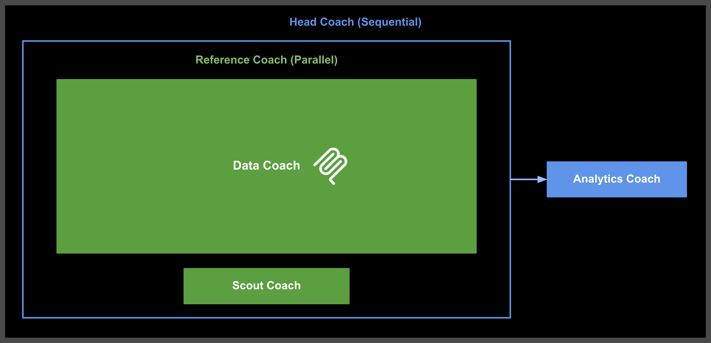

# 4-ohtani-mcp 使用說明書

本目錄包含一個基於 MCP（Model Context Protocol）的多代理系統，專門用於大谷翔平相關的數據查詢、分析和情報蒐集。系統採用階層式架構，透過 MCP 工具集實現資料庫交互，包含一個主控制代理和三個專業子代理。

## 系統架構圖



## 目錄結構

```
4-ohtani-mcp/
├── README.md                        # 本說明文件
├── Workflow.png                     # 系統架構圖
└── head_coach_agent/                # 主控制代理
    ├── __init__.py
    ├── agent.py                     # 主代理定義
    └── subagents/                   # 子代理目錄
        ├── __init__.py
        ├── analytics_coach_agent/   # 分析教練代理
        │   ├── __init__.py
        │   └── agent.py
        ├── data_coach_agent/        # 數據教練代理（MCP 實現）
        │   ├── __init__.py
        │   ├── agent.py
        │   ├── prompt.py
        │   ├── server.py            # MCP 服務器實現
        │   └── stats.db             # SQLite 數據庫
        └── scout_coach_agent/       # 情蒐代理
            ├── __init__.py
            └── agent.py
```

## 環境設定

### 1. 配置環境變數

本系統使用與 `2-ohtani-rag` 相同的環境配置。請參考根目錄的 `.env.example` 檔案進行設定：

#### 選項 1: 使用 Vertex AI
```env
GOOGLE_GENAI_USE_VERTEXAI=TRUE
GOOGLE_CLOUD_PROJECT=your-project-id
GOOGLE_CLOUD_LOCATION=us-east5
```

#### 選項 2: 使用 Google AI API
```env
GOOGLE_GENAI_USE_VERTEXAI=FALSE
GOOGLE_API_KEY=your-api-key
```

⚠️ **重要提醒**：請勿將真實的 API 金鑰提交到版本控制系統中。

### 2. 安裝依賴套件

確保您已安裝必要的 Python 套件，特別是 MCP 相關依賴。

## 啟動和使用方式

### 1. 身份驗證設定（僅限 Vertex AI 使用者）

如果您在環境設定中選擇了「Vertex AI」，必須先進行 Google Cloud 身份驗證：

```bash
gcloud auth application-default login
```

**注意**：如果您使用的是「Google AI Studio」，請跳過此步驟。

### 2. 啟動 Dev UI

使用終端機導航到 4-ohtani-mcp 目錄：

```bash
cd 4-ohtani-mcp
```

執行以下命令啟動 Dev UI：

```bash
adk web
```

### 3. 開啟網頁介面

在瀏覽器中開啟提供的 URL（通常是 `http://localhost:8000`），在左上角的下拉選單中選擇 `head_coach_agent`。

## 系統功能介紹

### 主控制代理

**Head Coach Agent** 是整個系統的核心控制器，採用 `SequentialAgent` 架構，負責協調所有子代理的工作流程。

### 子代理詳細說明

#### 1. Reference Coach (Parallel Agent)

**功能**：並行執行數據查詢和情報蒐集
- 同時啟動 Data Coach 和 Scout Coach
- 提高系統效率，減少總體執行時間
- 與 2-ohtani-rag 架構保持一致

#### 2. Data Coach Agent（MCP 實現）

**檔案位置**：`head_coach_agent/subagents/data_coach_agent/agent.py`

**功能描述**：
- 專門透過 MCP 工具查詢大谷翔平資料庫數據的代理
- 使用 MCPToolset 替代直接 SQL 查詢

**主要特色**：
- **MCP 工具集成**：使用 `MCPToolset` 與 `StdioServerParameters`
- **工具豐富**：提供多種資料庫操作工具

**可用的 MCP 工具**：
1. `list_db_tables`：列出所有資料庫表格
2. `get_table_schema`：取得特定表格的結構
3. `query_db_table`：查詢特定表格的資料
4. `execute_sql_query`：執行自定義 SQL 查詢

**工作流程**：
1. 判斷問題是否與大谷翔平相關
2. 選擇適當的 MCP 工具進行查詢
3. 返回查詢結果供後續分析

#### 3. Scout Coach Agent

**檔案位置**：`head_coach_agent/subagents/scout_coach_agent/agent.py`

**功能描述**：
- 情蒐教練代理，專門進行運動員相關的情報蒐集與總結
- 使用 Google 搜尋工具獲取最新資訊
- 智能判斷是否需要網路查詢

**主要特色**：
- 具備 `google_search` 工具
- 專注於運動員相關情報
- 與 2-ohtani-rag 功能保持一致

**查詢原則**：
- 可查詢任何運動員的相關資訊
- 預設查詢大谷翔平相關資訊
- 只在需要網路資料時才使用搜尋工具

#### 4. Analytics Coach Agent

**檔案位置**：`head_coach_agent/subagents/analytics_coach_agent/agent.py`

**功能描述**：
- 分析教練代理，專門整合情蒐資料與數據庫查詢結果
- 提供綜合性的運動員分析報告
- 結合定量數據與定性情報

**主要特色**：
- 整合多方面資料來源
- 專業的運動分析角度
- 與 2-ohtani-rag 分析邏輯一致

**分析原則**：
1. **數據優先**：以數據庫的實際數據為分析基礎
2. **情報補強**：用網路情蒐的資訊補充和驗證數據分析
3. **全面整合**：將定量數據與定性情報相結合
4. **專業呈現**：用專業的運動分析角度來解讀和呈現結果

## MCP 服務器實現

**檔案位置**：`head_coach_agent/subagents/data_coach_agent/server.py`

**功能描述**：
- 實現完整的 MCP 服務器
- 提供標準化的工具接口
- 支援 stdio 通信協議

**核心功能**：
- **工具註冊**：自動將 ADK FunctionTools 轉換為 MCP 工具
- **請求處理**：處理 `list_tools` 和 `call_tool` 請求
- **錯誤處理**：完善的異常處理和日誌記錄
- **資料庫連接**：安全的 SQLite 連接管理

## 使用範例

**問題**：「大谷翔平最近的打擊表現如何？」

**系統執行流程**：
1. **Reference Coach** 並行啟動數據查詢和情報蒐集
2. **Data Coach** 透過 MCP 工具查詢資料庫
   - 使用 `list_db_tables` 獲取可用表格
   - 使用 `get_table_schema` 了解表格結構
   - 使用 `query_db_table` 或 `execute_sql_query` 查詢數據
3. **Scout Coach** 同時搜尋網路上關於大谷翔平最新表現的資訊
4. **Analytics Coach** 整合 MCP 查詢結果和網路情報，提供綜合分析報告

## 系統特色

### 1. MCP 協議整合
- 完整實現 Model Context Protocol
- 標準化的工具接口和通信協議
- 提升系統的互操作性和擴展性

### 2. 安全性增強
- MCP 服務器層面的訪問控制
- 規範化的資料庫操作流程
- 完善的錯誤處理和日誌記錄

### 3. 架構簡化
- 相比 2-ohtani-rag 減少了複雜的循環邏輯
- 直接的並行處理架構

### 4. 工具標準化
- 遵循 MCP 標準的工具實現
- 統一的工具註冊和調用機制
- 易於維護和擴展的工具架構

## 技術架構說明

### 代理類型

1. **SequentialAgent**：按順序執行子代理
2. **ParallelAgent**：並行執行子代理
3. **LlmAgent**：基於大語言模型的單一代理

### MCP 工具架構

1. **MCPToolset**：MCP 工具集成器
2. **StdioServerParameters**：stdio 通信參數
3. **FunctionTool**：ADK 功能工具包裝器
4. **adk_to_mcp_tool_type**：工具類型轉換器

### 狀態管理機制

與 2-ohtani-rag 相同的狀態管理機制：
- **狀態設置與讀取**：透過 `tool_context.state` 操作
- **代理輸出狀態**：使用 `output_key` 設置狀態
- **跨代理共享**：實現資訊和狀態的共享

### 模型使用

- **gemini-2.5-flash**：用於複雜的 MCP 工具調用和數據查詢
- **gemini-2.5-flash-lite**：用於分析和情報蒐集任務
- **模型擴展性**：支援透過 LiteLLM 整合其他模型

## 常見問題

### Q: 如何添加新的 MCP 工具？
A: 
1. 在 `server.py` 中實現新的工具函數
2. 將函數包裝為 `FunctionTool`
3. 添加到 `ADK_DB_TOOLS` 字典中
4. MCP 服務器會自動註冊和公開新工具

### Q: MCP 服務器如何處理錯誤？
A: 
- **異常捕獲**：完整的 try-catch 錯誤處理
- **日誌記錄**：詳細的操作和錯誤日誌
- **錯誤回傳**：標準化的錯誤響應格式
- **服務隔離**：錯誤不會影響代理運行

### Q: 系統性能如何？
A: 
- **並行處理**：數據查詢和情報蒐集同時進行
- **服務器效率**：MCP 服務器提供高效的工具調用
- **資源管理**：適當的連接池和資源釋放
- **簡化架構**：相比 2-ohtani-rag 減少了複雜邏輯

## 下一步

完成 4-ohtani-mcp 的學習後，您可以：

1. 比較 2-ohtani-rag 和 4-ohtani-mcp 的架構差異
2. 嘗試將 2-ohtani-rag 的 RAG 功能整合到 4-ohtani-mcp 的工具列中
3. 學習如何實現自己的 MCP 服務器
4. 探索 Model Context Protocol 的更多應用場景
5. 開發基於 MCP 的多代理系統
6. 研究如何將 MCP 整合到現有的 AI 應用中
